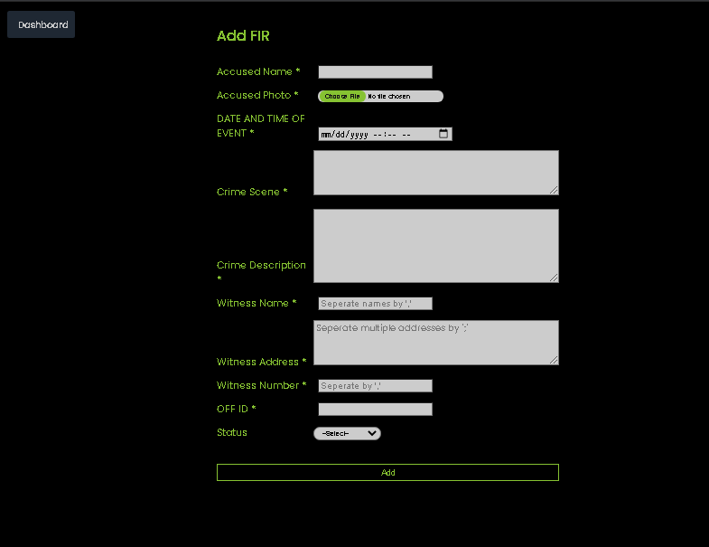

# CRIME STACK
#### This is a criminal Record Management System.

* A user-friendly web application for managing criminal and police officer’s records in the police department using php and Mysql.

* The application allows CRUD operations for Police Officers , Police Stations and Criminals
* The application also provides the option to download a ChargeSheet with all details of a criminal.
* The main entities are the petitioner,accused , the charges levied against him and the investigating officer.

